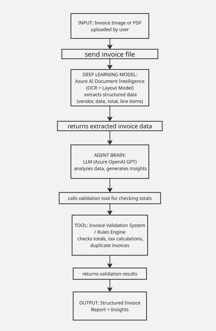

# Invoice Analysis Agent

Single-agent assistant that OCRs an invoice with **Azure AI Document Intelligence**, reasons with **Azure OpenAI**, validates totals with a rules tool, and pulls **policy context via BM25 retrieval (RAG)**—then returns a structured AP-friendly report.

## Team
=======
Team DK — **Dat Dang Nguyen and Khanh Huynh**.  


## Problem and users

Many organizations, particularly small and medium-sized businesses, rely on manual processes to handle invoices. Employees must review invoices one by one, extract important details such as vendor name, invoice date, total amount, and line items, and then enter this information into accounting systems. This process is repetitive, time-consuming, and highly prone to human error. As businesses grow and the number of invoices increases, these inefficiencies become more significant, leading to delays in financial reporting and increased operational costs.
The target users of this system include accountants, finance teams, and business owners who regularly process invoices but may not have access to advanced automation tools. These users often spend considerable time performing routine data entry tasks rather than focusing on higher-value financial analysis. Automating invoice processing is important because it reduces manual workload, improves accuracy, and enables businesses to scale more efficiently.
The proposed Invoice Analysis Agent aims to address this problem by automatically scanning invoices, extracting structured information via OCR, and generating a clear, structured report. By automating both data extraction and analysis, the agent can significantly improve efficiency and reduce errors in invoice processing workflows.


## Option chosen

Option A: Single AI Agent for this project. The invoice analysis task follows a relatively linear workflow: receiving an invoice, extracting data, analyzing the information, and generating a report. A single agent is sufficient to handle all these steps effectively. Introducing multiple agents would add unnecessary complexity without significantly improving performance.
A single-agent design allows for a more streamlined architecture, easier debugging, and faster development. Since the main goal is to demonstrate the integration of deep learning models with reasoning and tool use, a single agent provides a clear, focused implementation that aligns well with the project requirements.


## Architecture

The workflow is intentionally linear: **file → OCR → LLM (ReAct) → tools → report**, with **short-term conversational memory** via a LangGraph checkpointer.



## Frameworks and tools

- **LangGraph** (`create_react_agent`) for a **ReAct** tool-calling loop  
- **LangChain** (messages, tools, community retrievers)  
- **Azure OpenAI** (chat / reasoning)  
- **Azure AI Document Intelligence** (`prebuilt-invoice`)  
- **BM25 lexical retrieval** over markdown policy docs in `data/knowledge/` (RAG)  
- **Python 3.10+** 

## Installation

1. **Install Python**  
   Use **Python 3.10 or newer** (3.11+ recommended).

2. **Create a virtual environment (recommended)**

```bash
python -m venv venv
```

Windows PowerShell:

```powershell
.\venv\Scripts\Activate.ps1
```

macOS/Linux:

```bash
source venv/bin/activate
```

3. **Install dependencies**

```bash
pip install -r requirements.txt
```

4. **Configure environment variables**

Copy the template and fill in your Azure values:

```bash
copy .env.example .env
```

PowerShell uses `copy`; macOS/Linux use `cp`.

Edit `.env` (never commit real keys):

- `AZURE_OPENAI_API_KEY`
- `AZURE_OPENAI_ENDPOINT` (like `https://YOUR_RESOURCE.openai.azure.com`)
- `AZURE_OPENAI_CHAT_DEPLOYMENT_NAME` 
- `AZURE_OPENAI_API_VERSION` 
- `AZURE_DOCUMENT_INTELLIGENCE_ENDPOINT`
- `AZURE_DOCUMENT_INTELLIGENCE_KEY`


```

## How to run the agent

From the repository root (with your venv activated):

```bash
python main.py --invoice PATH_TO_INVOICE.pdf
```

Equivalent alternate entrypoint:

```bash
python run_agent.py --invoice PATH_TO_INVOICE.pdf
```


```bash
python main.py --invoice data/sample_invoices/sample.pdf 
```

## Example usage (what to expect)

> Note: exact OCR fields depend on the invoice layout and model output.

### Example 1 

**Input**

```bash
python main.py --invoice data/sample_invoices/X00016469670.jpg
```

**Output**

Summary
- Invoice from "tan chay yee" (OJC MARKETING SDN BHD) to "THE PEAK QUARRY WORKS".
- Invoice date: 2019-01-15. Invoice ID: PEGIV-1030765.
- Total amount: 193.00 MYR.

Key Fields
- Vendor: tan chay yee (OJC MARKETING SDN BHD)
- Vendor Address: NO 2 & 4, JALAN BAYU 4, BANDAR SERI ALAM, 81750 MASAI, JOHOR
- Customer: THE PEAK QUARRY WORKS
- Invoice Date: 2019-01-15
- Invoice Total: 193.00 MYR
- Tax: 0.00 MYR

Line Items
- 1 item: Description "000000111", Quantity 1, Unit Price 193.00 MYR, Amount 193.00 MYR

Validation
- All totals match: line item sum, subtotal, and invoice total are consistent.
- No tax applied (TotalTax: 0.00 MYR).

### Example 2 

**Input**

```bash
python main.py --invoice data/sample_invoices/X00016469671.jpg
```

**Output (shape)**

Summary:
- The invoice was successfully processed and key fields were extracted with high confidence.

Key Fields:
- Invoice ID: PEGIV-1030531
- Invoice Date: 2019-01-02
- Vendor Name: tan chay yee
- Vendor Address Recipient: OJC MARKETING SDN BHD
- Vendor Address: NO 2 & 4, JALAN BAYU 4, BANDAR SERI ALAM, 81750 MASAI, JOHOR
- Invoice Total: 170.00 MYR

Line Items:
- 1 item:
  - Description: 000000111
  - Quantity: 1.0
  - Unit Price: 170.00 MYR
  - Amount: 170.00 MYR

Validation:
- The sum of line item amounts matches the invoice total (170.00 MYR).
- No discounts applied (0.00 MYR).
- Not enough additional numeric fields (such as tax or subtotal) present to perform a full validation.

Risks/Anomalies:
- No tax, subtotal, or additional charges/fields were detected; this limits the scope of validation.
- All extracted fields are high-confidence, but if you require tax or more detailed breakdowns, this invoice does not provide them.

Recommended Next Actions:
- Review the invoice for completeness, especially if your policy requires tax or subtotal fields.

### Example 3 

**Input**

```bash
python main.py --invoice data/sample_invoices/X51005200931.jpgg
```

**Output (shape)**

Summary:
- The invoice was successfully processed and key fields were extracted with high confidence.
- There was an issue validating the invoice totals due to a formatting problem in the extracted data.

Key Fields:
- Vendor: GOGIANT ENGINEERING (M) SDN
- Vendor Tax ID: 000800689824
- Vendor Address: JALAN PERMAS 9/5, NO.59, 81750 BANDAR BARU PERMAS JAYA
- Invoice Date: 2018-02-09
- Invoice Total: 436.20 MYR
- Subtotal: 411.50 MYR
- Total Tax: 24.69 MYR (Tax Rate: 8%)
- Discount: 0.00 INR (possible currency mismatch, see Risks)

Line Items:
1. SR CERAMIC CAP (Code: 6783): 5 × 3.50 MYR = 17.50 MYR
2. S/STEEL 1/2" STREET ELBOW (Code: 2954): 30 × 3.80 MYR = 114.00 MYR
3. 2.4MM STARWELD RED HEAD TUNGSTEN ROD (Code: 1760): 1 × 55.00 MYR = 55.00 MYR
4. ESICUT 4" CUTTING DISC (1BOX)-50PCS (Code: 3496): 3 × 33.00 MYR = 99.00 MYR
5. WELDRO PICKLING GEL 1KG (Code: 2460): 2 × 43.00 MYR = 86.00 MYR
6. 13.5" WELDING GLOVE - GREEN (GS) (Code: 9428): 4 × 10.00 MYR = 40.00 MYR

## Knowledge base (RAG sources)

Synthetic policy markdown lives in:

- `data/knowledge/validation_tolerances.md`
- `data/knowledge/required_fields.md`
- `data/knowledge/fraud_and_duplicates.md`

These are **not** proprietary data; they exist so reviewers can see what the retriever is grounded on.

## Known limitations

- Requires **working Azure credentials** for both **Document Intelligence** and **Azure OpenAI** chat.  
- OCR quality depends on scan quality, rotation, and layout; some invoices will have missing fields.  
- The totals validator is a **deterministic heuristic** (not a full accounting engine) and may be inconclusive when tax/subtotal fields are absent.  
- Conversation memory uses an **in-memory checkpointer** (`MemorySaver`): it helps multi-turn demos, but it is **not** durable across process restarts.  
- No automatic ERP posting (export/reporting only).

## Demo video


(https://www.loom.com/share/30e0d9aa1c9b434eb3b7266c8db71c4e)
=======


## Repository layout

- `main.py`, `run_agent.py` — CLI entrypoints  
- `src/agent.py` — LangGraph ReAct agent wiring  
- `src/tools.py` — OCR tool, totals tool, policy search tool  
- `src/memory.py` — BM25 retriever + checkpointer factory  
- `src/di_client.py` — Document Intelligence client wrapper  
- `data/knowledge/` — RAG corpus  
- `architecture.png` — embedded architecture diagram  

## Security note

Never commit `.env` or real API keys. This template uses `.gitignore` to exclude `.env`. 
